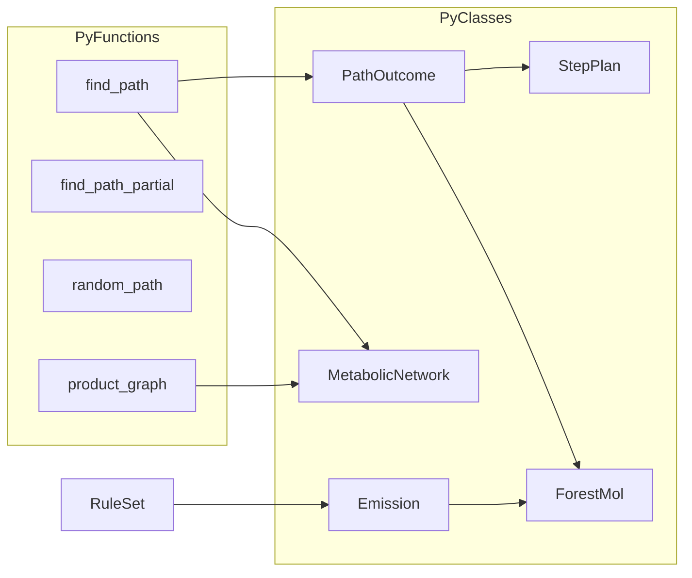
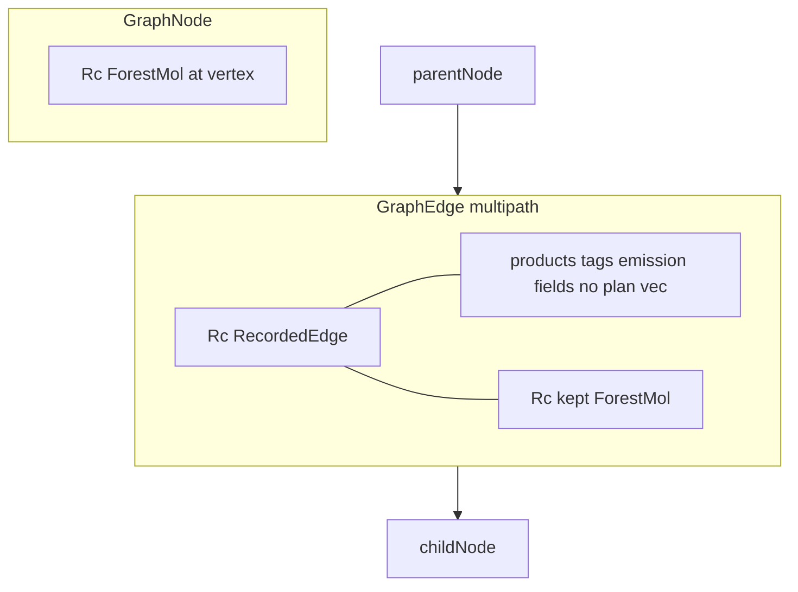
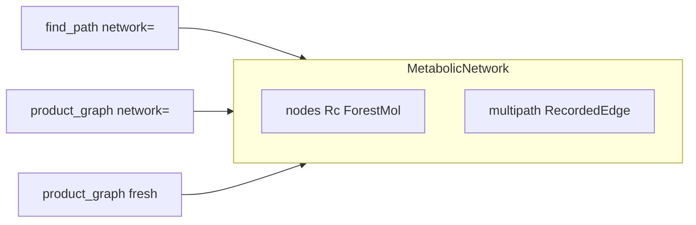
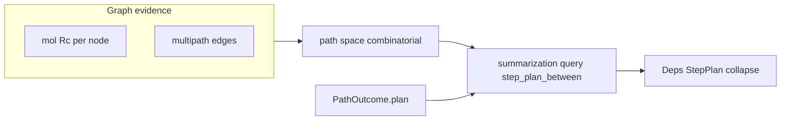
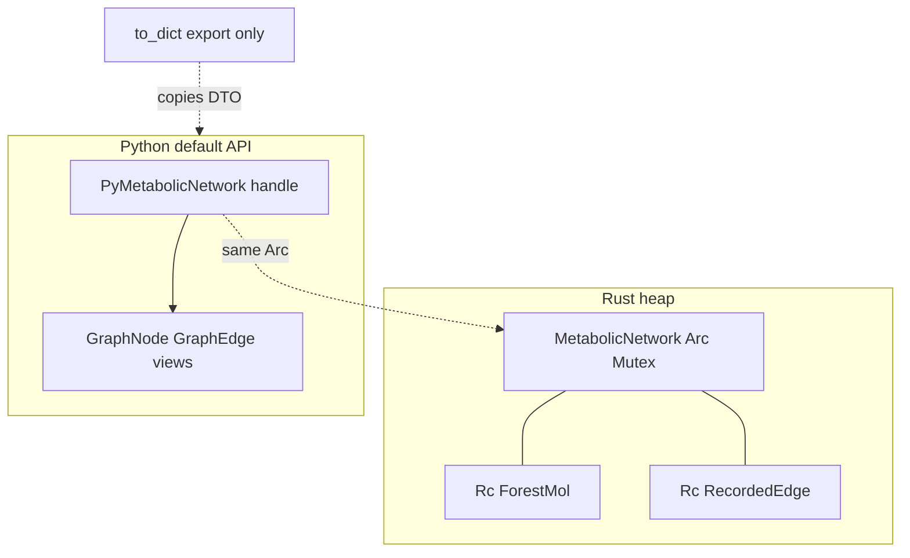

# PyO3 handle API port

## Goal

Python callers get **Rust-backed objects** (`ForestMol`, `PathOutcome`, `StepPlan`, `MetabolicNetwork`, …) with behavior and composition across APIs. **Marshalling is opt-in** via `.to_dict()` on the types that replace today’s dict returns — **not** the default return shape of `find_path`, `metabolize`, or graph builders.

**Why (tied to §3e–§3f):** The product graph is **`Rc<ForestMol>` nodes**, **`Rc<RecordedEdge>`** multipath edges, and **shared `Arc<Mutex<MetabolicNetwork>>`** across calls. **Eager dict/JSON marshalling would defeat the design:** copy every mol and emission at every API boundary, lose **`Rc` identity** (same vertex / same `kept` mol no longer matches what search recorded), force **CSMI/SMILES round-trips** instead of tagged **`ForestMol`**, and make **`find_path(..., network=net)`** + **`product_graph(..., network=net)`** impossible to treat as one live graph. Handles keep payload in Rust; Python **views** index into it; **`.to_dict()`** is for export, tests, and notebooks only.

**No changes** to frozen [`src/xenosite/forest/native/`](src/xenosite/forest/native/) beyond parity tests that call the product extension.

**Key gate: complete test parity before and after across the whole suite.** Baseline **`make test`** green on the branch before binding work; ship only when **`make test`** is green again with the **same pass/fail/xfail profile** (no new skips, no silenced assertions — [never-skip-tests](.cursor/rules/never-skip-tests.mdc)). Product API tests may change **how** they assert (pyclass vs dict); native/legacy/Rust crate tests must not regress behavior.

**Only additive feature beyond the port:** **product `ForestMol` RDKit utilities** (see §3b) — lazy-import `rdkit` inside methods/constructors; **no** RDKit in `crates/xenosite-forest` and **no** changes to frozen native RDKit plumbing.

**Second goal: dramatically trim hand-written wrapper code.** The main lever is **scaling `#[pyclass]`** (full plan/path/graph/emission tree from the naming table below) with a **`pyhandle!` macro** so each type costs ~10 lines + delegated `pymethods`, not custom PyDict/`json!` per API. Dict-shaped export is a **thin `.to_dict()`** via shared Serde views — not a parallel binding path. Today’s bloat is **eager dict returns + duplicated field lists** in [`python_api.rs`](crates/xenosite-forest/src/python_api.rs) and [`wasm_api.rs`](crates/xenosite-forest/src/wasm_api.rs); replacing that with **many small pyclasses** is net fewer lines and matches the product door (`ForestMol` already proves the pattern).

## Architecture



**Naming (public Python, align with [docs/forest/RUST.md](docs/forest/RUST.md)):**

| Rust | `#[pyclass(name = …)]` |
|------|-------------------------|
| `PathOutcome` | `PathOutcome` |
| `PartialOutcome` | `PartialPathOutcome` |
| `PathCounters` | `PathCounters` |
| `PathStep` (walk) | `WalkStep` |
| `Deps` | `StepPlan` |
| `Step` | `PlanStep` |
| `PlanAtom` | `PlanAtom` (enum or single class + `kind`) |
| `Maybe` | `Maybe` |
| `CleavageSide` | `CleavageSide` |
| `Emission` | `Emission` |
| `RandomPathOutcome` | `RandomPathOutcome` |
| `MetabolicNetwork` (only graph type) | `MetabolicNetwork`, `GraphNode`, `GraphEdge` (see §3e–§3f) |
| `Emission` / recorded hop | `Emission` pyclass + edge `RecordedEdge` (§3e) |
| `AtomDiffResidual` | `AtomDiffResidual` |

## 1. Engine: outcomes + StepPlans tied to the graph

Today [`PathOutcome`](crates/xenosite-forest/src/find_path.rs) copies **`plan: Deps`** off the in-memory [`Walk`](crates/xenosite-forest/src/find_path.rs) at hit yield (~L1819–L1827) while the **network** records a thin hop in parallel. That duplicates plan state and diverges from §3e–§3h.

**Target:**

- **Add `mol: ForestMol`** on `PathOutcome` / `PartialOutcome` at yield (from `walk.mol`).
- **StepPlan / `Deps` = summarization query results** (§3i) over the graph — **not** a stored path, **not** an enumeration of every walk. The graph holds a **combinatorially large** path space (multipath edges); **`step_plan_between(from, to)`** is the **v1 query** that **collapses** that space into a compact **dependency-oriented** summary ([`Deps`](crates/xenosite-forest/src/canonical_plan.rs): steps + precedes + maybe, optionally **`linearizations()`** when materialization is needed).
- **Walk:** **omit** **`walk.plan` / `walk.maybe`** (and do **not** persist hop **`plan`** on edges — §3e). Per-hop normalized elementary steps are **hard to keep consistent** on the walk; **`step_plan_between`** synthesizes **`Deps`** from graph topology + non-plan edge evidence when needed.
- **Migration:** yield dedup moves to **`step_plan_between(root, target)`** after edges are recorded; remove walk plan accumulation in the same refactor (no long-lived dual source).

- `PathOutcome.smiles` / Python getter remains convenience (`mol.csmi()`), not a re-parse.
- Document in [`docs/forest/RUST.md`](docs/forest/RUST.md): tagged mols from graph handles; **StepPlans** are **summarization query** results over recorded paths, not CSMI re-parse or dict round-trips.

## 2. Minimize binding code by scaling pyclasses

**Principle:** One **`#[pyclass]` + `inner: T` per engine type** you want Python to hold (Step, Maybe, Hop, …). That scales binding code **down** versus manual marshalling because:

- **Read path:** `#[getter]` / `get_all` / delegate to `inner.field` — no conversion graph.
- **Next Rust call:** `downcast` → `&inner` — no Serde parse.
- **Export path only:** `.to_dict()` — one DTO + `pythonize`, shared with WASM later.

Invest up front in **`pyhandle!` + module split** so adding the Nth pyclass is mechanical, not a new dict builder.

### 2a. Shared **export DTO** layer (`.to_dict()` / JSON only — not the primary API)

Add [`crates/xenosite-forest/src/export.rs`](crates/xenosite-forest/src/export.rs) (or `export/mod.rs`) with **`#[derive(Serialize)]` view structs** only — not on engine types:

- `PathOutcomeView`, `PathCountersView`, `RandomPathOutcomeView`, `HopView`, `PlanStepView`, …
- **`impl From<&EngineType> for View`** (or `From<&PathOutcome>`) — **one** mapping per public shape.

Wire deps:

- New Cargo feature **`export = ["serde", "serde_json"]`**; **`python = ["export", "dep:pythonize"]`** (or equivalent) so `.to_dict()` is one line: `pythonize::pythonize(py, &View::from(&self.inner))`.
- **Delete** `path_outcome_dicts`, `counters_dict`, and duplicated `json!` blocks in Python paths; **later** point WASM at the same views (follow-up, not blocking).

This is where “explicit read” lives — **not** in scattered `PyDict::new` loops.

### 2b. **`pyhandle!` macro** (stop copy-pasting `{ inner: T }`)

In `python_api/macros.rs`, a small declarative macro:

- Generates `PyFoo { inner: Foo, …caches }`, `wrap(inner)`, `borrow_inner(&self) -> &Foo`.
- Optional attributes: `unsendable`, `pyclass(name = "…")`.

Hand-write **`#[pymethods]` only where Rust logic exists** (`allows`, `apply`, `closest`, `metabolize`, …). Everything else is **`pyhandle!` + getters** (or `get_all` on leaf types).

### 2c. **Two pyclass shapes** (both scale with the macro — not “fewer pyclasses”)

| Shape | Examples | Binding style |
|------|----------|----------------|
| **Mutable handle** | `ForestMol`, `StepPlan`, `PathOutcome`, `RuleSet`, `MetabolicNetwork` | `pyhandle!` + delegate methods to `inner` |
| **Immutable leaf** | `PlanStep`, `WalkStep`, `CleavageSide`, `Hop`, counters, residual | Same macro; often **`frozen` + `get_all`** from `inner` — still a pyclass, still passable if needed |

**Full tree:** pyclass **all** named types in the table in §Architecture (including `PlanAtom`, `Maybe`, graph nodes/hops). **`PlanAtom`**: PyO3 enum pyclass or single frozen class — one pyclass, not three hand-rolled classes.

**Graph edges:** one **`GraphEdge` pyclass** over **`RecordedEdge`** (§3e) + shared export view for `.to_dict()` only — no parallel `ProductHop` / `MetabolicHop` bindings.

### 2d. **Caching policy (short, not sprawling)**

Only **`ForestMol`-style** caches where identity matters (`csmi`, `formula`, cached `Py<StepPlan>` on `PathOutcome`). Everything else: cheap `wrap(inner.clone())` or snapshot copy — **no** cache field per type unless profiling says otherwise.

### 2e. What we deliberately do **not** write

- Per-type `PyDict` set_item chains for default returns.
- Mirror of every `impl` method on engine types — expose the **product subset** (native parity + docs), add on demand.
- Second Python wrapper layer beyond [`__init__.py`](src/xenosite/forest/__init__.py) re-exports (stay thin).

**Success metric:** net **line count down** in `python_api*` vs today’s monolith despite **more** pyclasses — macro + DTO replace dict helpers; typical new type ≈ **macro block + 0–5 delegate methods**, not a new serialization function.

## 3. Split and implement bindings

[`python_api.rs`](crates/xenosite-forest/src/python_api.rs) (~1.3k lines) → module tree under `crates/xenosite-forest/src/python_api/`:

- `mod.rs` — `#[pymodule]`, re-exports
- `macros.rs` — `pyhandle!`
- `mol.rs` — `PyForestMol`, `PyFormula` (existing)
- `plan.rs` — handles + delegate `allows`, `__getitem__`, …
- `path.rs` — `find_path` / `find_path_partial`; outcomes + `.to_dict()` → export views
- `walk.rs` — `random_path` + `RandomPathOutcome`
- `graph.rs` — `MetabolicNetwork`, `GraphNode`/`GraphEdge` views, `product_graph` (returns same type)
- `rules.rs` — `metabolize` → `Vec<Emission>`; keep filter Python callbacks isolated (only “fat” binding block)

**Patterns:**

- **`find_path` body stays thin:** config → `find_path_with(_network)` → outcomes wrap **`Arc<MetabolicNetwork>`** + **`from_idx` / `to_idx`**; **`.plan`** → **`step_plan_between`** (§3i).
- **`.to_dict()`** on handle types: single export view + `pythonize` (section 2a).

**`find_path` / `find_path_partial` signatures (unchanged kwargs):**

- Return `(list[PathOutcome], PathCounters)` and `(list[PathOutcome], list[PartialPathOutcome], PathCounters)`.
- `network=` mutates in-place **`MetabolicNetwork`** (§3e–§3f). Py: `node(i)`, `get(csmi)`, inbound **`GraphEdge`** with **`.emission` / `.kept_mol`**.

**`product_graph(...)`** → **`MetabolicNetwork`** (not a second graph class). Optional **`network=`** on `product_graph` to **continue the same graph** (BFS layer on existing nodes/edges).

**`metabolize`:** return **`Emission`** objects with `.products: list[ForestMol]`, `.pattern_name`, `.site`, `.rule_path`, plus `.product_csmis()` for explicit downgrade (parity tests).

**GIL (phased after pyclass port):** Release only around **pure Rust** work; rebuild Python handles **after** the closure (see §3c). Not required for pyclass correctness.

**WASM:** out of scope; [`wasm_api.rs`](crates/xenosite-forest/src/wasm_api.rs) stays JSON for now (optional later: shared export DTOs).

### 3b. Product `ForestMol` RDKit interop (Python only)

Rust stays **SMILES / chematic only** ([`PyForestMol::new(smiles)`](crates/xenosite-forest/src/python_api.rs)). Bridge on the **public stub**, not in native:

- Add a small module e.g. [`src/xenosite/forest/mol.py`](src/xenosite/forest/mol.py) (or inline in [`__init__.py`](src/xenosite/forest/__init__.py) if it stays tiny).
- Export **`ForestMol`** as a **Python subclass or factory** of `_rust.ForestMol` that:
  - **`__init__(self, spec)`** — `str` → `super().__init__(spec)`; RDKit `Mol` → lazy `from rdkit import Chem`, `Chem.MolToSmiles(mol)` (or canonical helper consistent with parity tests), then super.
  - **`to_rdkit(self)`** — lazy import; `Chem.MolFromSmiles(self.csmi)` (document: chematic CSMI spelling may differ from RDKit-native walks; **atom tags are not round-tripped** — product mol is chematic-tagged, RDKit view is for display/interop only).
  - Optional **`@classmethod from_rdkit(cls, mol)`** if clearer than overloading `__init__`.
- **`_lazy_rdkit()`** — single place that imports RDKit and raises **`ImportError`** with “install `xenosite-forest[rdkit]`” if missing (no import-time dependency; default CI without RDKit stays valid).
- Do **not** duplicate native `rdkitutil.ForestMol` / `_forest` tagging; this is a thin SMILES bridge for notebooks and mixed pipelines.

**Tests:** [`tests/forest/rust/test_forest_mol_rdkit.py`](tests/forest/rust/test_forest_mol_rdkit.py) — `pytest.importorskip("rdkit")` (optional extra; gate remains **`make test`** with skip only for absent RDKit, not for product bugs). Round-trip smoke: RDKit → `ForestMol` → `to_rdkit()` → same canonical identity as native `canon()` where applicable.

### 3c. Releasing the GIL (PyO3 0.26)

**API:** `py.allow_threads(|| { ... })` — closure must be **`Send`**; no `Python<'_>`, no `PyRef`/`RefMut`, no Python callbacks inside.

**Pattern for `find_path` / `product_graph` / `random_path` (no Python filters):**

```rust
// 1. Prepare Send-only inputs on the stack (config, rules, strings, PathCounters).
let mut counters = PathCounters::default();
let hits = py
    .allow_threads(|| {
        find_path_with(reactant, target, &rules, &mut counters, config, |_| true)
            .map_err(py_err)?
            .collect_all()
            .map_err(py_err)
    })?;
// 2. GIL held again — wrap Vec<PathOutcome> → PyPathOutcome (cheap vs search).
Ok((wrap_hits(py, hits)?, PathCounters::wrap(counters)))
```

**`network=` (preferred — avoid cloning the graph):** store **`Arc<std::sync::Mutex<MetabolicNetwork>>`** inside `PyMetabolicNetwork`, not bare `MetabolicNetwork`. `MetabolicNetwork` is `Send`; the mutex makes `Arc` + lock usable inside `allow_threads`:

```rust
let arc = net.inner.clone(); // cheap Arc clone
py.allow_threads(move || {
    let mut guard = arc.lock().map_err(...)?;
    find_path_with_network(..., Some(&mut *guard), ...)
})?;
// Same Python `net` object; graph mutated in place under the lock.
```

- **No** full `MetabolicNetwork::clone()` per search (clone-back was a fallback only).
- **Contract:** one search at a time per `MetabolicNetwork` instance (mutex serializes concurrent `find_path(..., network=net)` on the same object — **approved**).
- Pyclass can stay **`unsendable`** for Python borrowing rules; GIL release is orthogonal.

**API:** keep **`network=` only** — callers **reuse one `MetabolicNetwork`** and grow it across multiple searches (append hops/nodes). **Do not** add a separate “return a fresh network” / `record_network=True` path; that would push disposable graphs and fights incremental exploration.

**Do not release GIL for:** `metabolize` with **`filter_rules` / `filter_sites`**; any `Python::attach` in filters.

**Order of work:** pyclass port → **`Arc<Mutex>` on `PyMetabolicNetwork`** (small binding change in graph module) → `allow_threads` on all pure-Rust entry points including **`network=Some`** → docs in `RUST.md`.

### 3d. Large graphs — no whole-graph clone

- **`PyMetabolicNetwork` only:** `Arc<Mutex<MetabolicNetwork>>` (§3c) — never whole-graph **`clone()`** on record/introspect paths.
- **Py node/edge objects:** **views** (`Arc` + index / edge id), not deep-clone `ForestMol` or emission per getter.

### 3e. Graph schema — `Rc<ForestMol>` nodes, emission-rich multipath edges

**Problem (today):** Two parallel containers — [`MetabolicNetwork`](crates/xenosite-forest/src/metabolic_network.rs) (`MetabolicHop`, search flags) and [`ProductGraph`](crates/xenosite-forest/src/product_graph.rs) (`ProductHop`, BFS-only) — duplicate schema and **cannot** attach BFS growth and `find_path` recording to the **same** object. Both strip **`ForestMol`** / full emission on record.

**Target schema** — **only [`MetabolicNetwork`](crates/xenosite-forest/src/metabolic_network.rs)** (rich nodes/edges; optional `recorded_edge.rs` for `RecordedEdge`). **NetworkX-style attribute bags** on nodes and edges (§3l) for flexible metadata; **typed spine** for index, adjacency, and **`ForestMol`** identity.

| Piece | Storage |
|-------|---------|
| **Node** | **`nodes: Vec<GraphNode>`** — **`NodeIdx`**, **`mol: Rc<ForestMol>`** (spine), **`attrs: AttrMap`** (§3l). **No** stored **`Deps`** (§3i). Search/prune flags (**`sealed`**, **`expanded`**, …) as **well-known `attrs` keys** (constants in Rust), not ad hoc struct fields — unless a key is needed for **`O(1)`** hot paths (document in **`RUST.md`**). |
| **Vertex index** | **`index: HashMap<Arc<str>, NodeIdx>`** (or `HashMap<String, NodeIdx>`) — **stable CSMI key → node index**. Key from **`ForestMol::stable_csmi_key()`** ([`mol::stable_csmi_key`](crates/xenosite-forest/src/mol.rs), same contract as find_path **`remember_seen`**). **Not** keyed by raw walk CSMI alone when stable key exists. See **§3h**. |
| **Edge** | **Bidirectional adjacency** (§3k): **`inbound`** / **`outbound`**. Each **`InboundEdge`**: spine **`parent_idx`**, **`kept: Rc<ForestMol>`**, **`attrs: AttrMap`** (§3l) — hop/emission fields live as **well-known edge keys** (and extensions), **no hop `plan` vec**. |
| **Emission / chemistry on edge** | **Required keys** in edge **`attrs`** (set by **`record_edge`**): site, orbit, site_atoms, cleaves, pattern_name, rule_path, search_bias, products ( **`Rc<ForestMol>`** list or handles), cleavage / maybe **inputs**, search-only ForestEmission fields (`dh_ends`, …), **`added_tags`**. Py **`GraphEdge`** / **`Emission`** expose typed getters over **`attrs`**; **`step_plan_between`** reads the same keys. Extra keys allowed without schema churn. |
| **Multipath** | **Append an edge on every discovery along a distinct enqueue**, not only the first `(parent, pattern, site, products)` — **remove** the `already` dedup in [`record_hop`](crates/xenosite-forest/src/metabolic_network.rs) / product_graph `via` push. |
| **Same CSMI, new tags** | **First discovery wins** for `node.mol`; later paths **only append edges** (tracking for alternate tag trees lives on **`kept` / edge emission**, not by replacing the node mol). |

**Recording sources:**

- **`find_path`:** **`record_edge(parent_idx, child_idx, RecordedEdge)`** after **`ensure_node(&ForestMol)`** resolves indices (§3h); lift **`ForestEmission` → `RecordedEdge`** (shared module if needed).
- **BFS (`product_graph` / `product_layer`):** refactor [`product_graph.rs`](crates/xenosite-forest/src/product_graph.rs) to **`&mut MetabolicNetwork`** + shared **`record_edge`** (module stays as **algorithms**, not a second graph struct). Remove **`ProductGraph` / `ProductNode` / `ProductHop`** from the public API once call sites migrate.



**`Rc` rules:** one **`Rc<ForestMol>`** per distinct mol **stored on a node**; edges **`Rc<RecordedEdge>`** sharing emission blobs when the same emission struct is reused in one enqueue (products vec holds **`ForestMol`** — use **`Rc<ForestMol>`** inside `RecordedEdge` for kept + products to avoid duplicate clones when sharing). No whole-graph clone; **`Arc<Mutex<Graph>>`** for Python + GIL.

**PyO3:** **`GraphNode` / `GraphEdge`** views: **`mol`**, **`kept_mol`**, typed getters; **`attrs`** as **`Mapping`** (mutable on the live graph under mutex) — NetworkX **`G.nodes[n]` / `G.edges[u,v]`** ergonomics. **`.to_dict()`** for export only (§3g).

**Tests / docs:** update network unit tests; note multipath edge count in [`docs/forest/RUST.md`](docs/forest/RUST.md); if behavior change is intentional vs old dedup, one line in [`docs/forest/HEURISTICS.md`](docs/forest/HEURISTICS.md) (`Status: approved` — multipath edge retention).

**Todo **`graph-rich-schema`** before **`pyclass-graph`** bindings** (bind the new shape, not legacy `MetabolicHop`).

### 3f. One graph type — cross-expansion

**Requirement:** A single in-memory graph so **BFS product exploration** and **heap search** can **extend the same structure** (multipath edges, shared `Rc<ForestMol>` nodes, one index).

| Concern | Single-type design |
|--------|---------------------|
| **Rust type** | **`MetabolicNetwork`** only. Delete **`ProductGraph`** as a distinct struct (keep `ProductGraphConfig` / stats names if useful, or rename to `BfsGrowthConfig`). |
| **Recording** | One **`ensure_node(&ForestMol)`** (§3h index) + **`record_edge(...)`** used by **`find_path`**, **`find_path_partial`**, and **BFS growth**. |
| **Search / prune metadata** | **`sealed`**, **`expanded`**, etc. via node **`attrs`** (§3l); **`targets: HashSet<NodeIdx>`** on network for §3j (plus optional **`attrs["is_target"]`** mirror if useful for Python). |
| **Python factory** | **`product_graph(...)`** returns **`MetabolicNetwork`**; add **`network=None`** — when set, run BFS **into** that handle (same mutex rules as `find_path(..., network=)`). |
| **PyO3** | One **`PyMetabolicNetwork`** (`Arc<Mutex<…>>`). **No `PyProductGraph`.** |
| **Public exports** | [`lib.rs`](crates/xenosite-forest/src/lib.rs) / [`__init__.py`](src/xenosite/forest/__init__.py): drop **`ProductGraph`** from `__all__`; document that **`product_graph` builds a `MetabolicNetwork`**. |



**WASM / JSON:** one serialization shape for the graph door (export DTO), not two hop structs.

### 3j. Prune nodes that do not lead to product

**Goal:** Keep summarization / search focused on the **target-facing** subgraph. Drop metabolite nodes that cannot participate in any valid route to a **marked product** (combinatorial exploration often leaves dead branches).

**Target marking:** **`mark_target(node_idx)`** (or set **`targets`** on the network). Search marks the **hit / goal `NodeIdx`**; BFS may mark a configured target CSMI node. **Root** **`root: NodeIdx`** is **never deleted** (even if it temporarily has no outgoing before first **`record_edge`**).

**Outgoing (forward):** use **`nodes[n].outbound`** (§3k). **`n` has no outgoing** when **`outbound.is_empty()`**.

**Fixpoint prune (user-specified rule):**

Repeat until stable:

1. Find **`n`** with **no outgoing edges**, **`n ∉ targets`**, **`n != root`**.
2. **Delete `n`**: remove from **`nodes`** / **`index`** (§3h); remove **`n`’s `inbound`** list (all edges **into** **`n`**); for each such edge **`p → n`**, decrement **`p`’s outgoing**; if **`p`** now has **no outgoing** and **`p`** is not a target and **`p != root`**, enqueue **`p`**.
3. Stop when no such **`n`** exists.

Peels **forward dead ends** that are not marked products (side branches that never extend toward a target).

**Efficient impl:** queue all eligible nodes (outgoing degree 0, not root, not target); on delete, update parent outgoing counts and enqueue newly eligible parents — **`O(V + E)`** per full prune.

**API:**

```text
prune_to_targets() -> PruneStats   // runs fixpoint; mutates in place
```

Optional: **`prune_to_targets_except(root, targets)`** if targets passed per call. Python: **`MetabolicNetwork.prune_to_targets()`** on the mutex handle.

**When to run:** optional after **`product_graph`** / **`find_path`** recording bursts; before expensive **`step_plan_between`** if graph is large; **not** automatic on every **`record_edge`** (batch prune). Document in **`RUST.md`**.

**Tests:** forward **leaf** side metabolite (no outgoing, not target) removed; chain **`root → … → target`** kept; **target** leaf kept even with no outgoing; **root** never removed; deleting leaf **`n`** may expose parent **`p`** with no outgoing → **`p`** removed in same fixpoint unless target/root.

### 3k. Parent / child tracking — efficient walks both ways

**Requirement:** Graph algorithms (**`step_plan_between`**, **`prune_to_targets`**, BFS, introspection) must walk **upstream** (parents) and **downstream** (children) without scanning all nodes/edges each time.

**On each `GraphNode`:**

```text
inbound:  Vec<InboundEdge>   // child-side: full hop payload + parent_idx
outbound: Vec<OutboundRef>   // parent-side: child_idx (+ inbound index for O(1) edge lookup)
```

**`record_edge(parent, child, …)`:** push **`InboundEdge`** on **`child`**, push matching **`OutboundRef`** on **`parent`**.

**Public accessors (Rust + Python views):** **`parents(i)`**, **`children(i)`**, **`inbound_edges(i)`**, **`outbound_refs(i)`** — iterate neighbors in **`O(degree)`**.

**Node deletion (prune):** remove **`n`’s inbound** (notify each **`parent`** to drop **`outbound`** to **`n`**), remove **`n`’s outbound** (drop **`inbound`** slots on children or tombstone — pick one strategy; keep indices stable or compact with **`EdgeId`** if needed). Document in **`RUST.md`**.

**Why:** Multipath **`inbound`** alone forces **`O(E)`** scan to find children; dual lists make forward/backward traversal and §3j prune **`O(V + E)`** total without repeated scans.

### 3l. NetworkX-style node / edge attribute maps

**Intent:** Flexible, mutable **property dictionaries** on nodes and edges (NetworkX **`G.nodes[n]`**, **`G.edges[u,v]`**), without reviving archive **`MetaboliteNetwork`** / Python NetworkX as the engine ([`DROPPED`](docs/forest/DROPPED.md) — **structure only**, product door stays Rust).

**Split (data-not-branches):**

| Layer | What |
|-------|------|
| **Spine** | **`NodeIdx`**, **`index`**, **`inbound` / `outbound`**, **`mol` / `kept`** **`Rc<ForestMol>`** — fixed; algorithms depend on these. |
| **`attrs`** | **`AttrMap`** per node and per **`InboundEdge`**: mutable **`BTreeMap<String, GraphValue>`** (or similar). **Well-known keys** as `pub const` + table in **`RUST.md`** (`NODE_SEALED`, `EDGE_PATTERN_NAME`, …). New metadata → **new key**, not new optional struct field. |
| **`GraphValue`** | Small enum: bool, i64, string, **`ForestMol`/`Rc` handle**, list of handles, … — enough for chemistry + tags; **no** arbitrary Python objects in Rust core (Py door may **`set_attr`** via conversion at boundary). |

**API:**

```text
node_attr(i, key) / set_node_attr(i, key, val)
edge_attr(child, inbound_slot, key) / set_edge_attr(...)
// Python: network.nodes[i]["sealed"] = True  (mapping protocol on view)
```

**`record_edge`:** writes **required edge keys** into **`attrs`**; callers/tools may add custom keys later.

**Export:** **`.to_dict()`** merges spine + **`attrs`** for JSON/notebooks; default API stays handles (§3g).

**Tests:** well-known keys round-trip; custom key survives **`record_edge`** + prune (if node kept); **`step_plan_between`** reads only documented keys.

### 3h. Mol indexing — stable key → `NodeIdx`

**Purpose:** Every API (`ensure_node`, `record_edge`, `mark_expanded`, Python **`get(csmi)`**, BFS queue dedup) must agree on **how a `ForestMol` maps to a graph row** without re-parsing SMILES or marshalling to Python.

**Layout on [`MetabolicNetwork`](crates/xenosite-forest/src/metabolic_network.rs):**

```text
nodes: Vec<GraphNode>            // each: mol, inbound, outbound (§3k), flags
index: HashMap<Arc<str>, NodeIdx>
root: Option<NodeIdx>
targets: HashSet<NodeIdx>        // prune §3j
```

Replace today’s **`BTreeMap<String, usize>`** keyed only by **`csmi()` string** with **`HashMap`** keyed by **stable key** when indexing is allowed (user-facing “CSMI index” is this map’s keys — they are stable canonical identity strings, not arbitrary input SMILES).

**Key function (single source of truth):**

```rust
fn vertex_key(mol: &ForestMol) -> Option<Arc<str>> {
    mol.stable_csmi_key().map(|k| Arc::from(k.as_ref())) // intern once per key
}
```

**Operations:**

| Method | Behavior |
|--------|----------|
| **`ensure_node(mol)`** | If **`vertex_key(mol)`** is **`Some(k)`** and **`index[k]`** exists → return that **`NodeIdx`**. Else push new **`GraphNode { mol: Rc::new(...), … }`**, insert **`index[k] = idx`**, return **`idx`**. |
| **`index_of_mol(mol)`** | **`vertex_key(mol).and_then(|k| index.get(k).copied())`** |
| **`index_of_key(k: &str)`** | Direct map lookup (Python **`network.get("…")`**, search target spelling after stable key of target). |
| **`node(i)`** | **`&nodes[i]`** — bounds-checked. |
| **`record_edge(parent, kept, emission)`** | **`p = ensure_node(parent)`** or parent already on walk; **`c = ensure_node(&kept)`**; append inbound edge on **`nodes[c]`** with **`parent_idx = p`**. |

**Unstable key (`stable_csmi_key()` is `None`):** Same **fail-closed** stance as find_path (no **`seen`** insert). Graph policy:

- **Still create a node row** when the walk/BFS enqueues the fragment (search must proceed).
- **Do not insert** into **`index`** — vertex is reachable only by **edge `kept` / vec position**, not by structure lookup.
- Counter **`unstable_csmi_key`** (already on path counters) documents how often this happens.

**Same CSMI, different tags:** Index merges on **stable key** only; **first discovery wins** for **`node.mol`** (§3e); alternate tag trees appear on **edge `kept`**.

**Interning:** Store **`Arc<str>`** (or **`Rc<str>`**) for keys in **`index`** and optionally **`node.key`** / display **`csmi`** from **`mol.csmi()`** for logging — avoid duplicating large strings on every edge.

**Python (no marshal):** **`MetabolicNetwork.index_of(mol: ForestMol) -> int | None`**, **`get(key: str) -> GraphNode | None`**, **`__len__` → `nodes.len()`**, **`node(i)`** — all read through **`Arc<Mutex<…>>`**.

**Tests:** stable-key merge (two `ensure_node` same structure → same idx); multipath → same child idx, **`inbound.len() > 1`**; unstable mol → two nodes if two enqueues without index merge; **`get(stable_key)`** round-trip.

### 3i. StepPlan — summarization queries over the path space

**Concept:** The graph **records** exploration (multipath edges, §3e) and therefore implies a **huge set of concrete walks** between nodes. A **StepPlan** ([`Deps`](crates/xenosite-forest/src/canonical_plan.rs) / Python **`StepPlan`**) is the answer to a **specific summarization query** that **collapses** that set into a **finite, canonical description** — elementary steps plus **dependency constraints** ([`precedes`](crates/xenosite-forest/src/canonical_plan.rs), [`canonical_dependency_edges`](crates/xenosite-forest/src/canonical_plan.rs)) and **`Maybe`** cleavage bags — so callers reason about **equivalence classes of orderings** ([`same_linearizations`](crates/xenosite-forest/src/canonical_plan.rs), [`n_linearizations`](crates/xenosite-forest/src/canonical_plan.rs)) without listing every path.

**Problem (today):** Yield returns a **single-walk** summary (linear **`walk.plan`** → **`as_deps`**, ~L1684–L1819). That **misrepresents** the graph when multiple routes exist and **does not scale** as a storage strategy. Walk/edge **plan vecs are omitted** (§3e); summaries are **computed queries** only.

**Requirement:** [`MetabolicNetwork`](crates/xenosite-forest/src/metabolic_network.rs) **stores** evidence only. **`Deps`** appear only as **query results**. **Nodes do not cache summaries.**

**Public Rust API (product door — names can settle in impl):**

```text
// v1 summarization query: collapse all recorded routes from → to
step_plan_between(from: NodeIdx, to: NodeIdx) -> Result<Deps, ForestError>
```

This query’s **contract** is semantic (what collapse means), not “replay one BFS path”. Document the contract in [`docs/forest/RUST.md`](docs/forest/RUST.md); non-obvious choices → [`docs/forest/HEURISTICS.md`](docs/forest/HEURISTICS.md). **Later queries** (other endpoint rules, sealed-node cuts, partial targets) should be **additional methods** or a small **query params** type — not special cases inside search ([data-not-branches](.cursor/rules/data-not-branches.mdc)).

Optional: **`step_plan_to_key(from, stable_key)`**; materialize **`Deps::linearizations()`** only when callers need explicit orders (still a handle / lazy iterator in Python, not a default dict dump).

**What `step_plan_between` must do (v1 collapse):**

| Input | Use |
|-------|-----|
| **`from`, `to`** | Endpoints in **`nodes`** / **`index`** (§3h). |
| **Path space** | All **recorded** **`from → to`** walks implied by multipath **`inbound`** edges — combinatorially many; **never enumerate** every walk. |
| **Per-edge data** | **`parent_idx`**, **`kept`**, **`RecordedEdge`** (§3e — **no plan vec**). Synthesis uses tagged **`nodes[parent].mol` → `kept`**, rule/pattern/site, products, cleavage-side inputs. |
| **Hop → Step** | Inside the query: emit elementary **`Step`**s per hop from catalog + **`ForestMol`** context — **not** cached plan on the edge. |
| **Collapse** | At confluence, **`merge_deps_at_confluence`** (or equivalent) so the summary reflects **all** contributing routes, not one prefix. |
| **Output** | One **`Deps`**: canonical steps + **`precedes`** + **`Maybe`** — compact encoding of the collapsed space; **`linearizations()`** when explicit orders are needed. Yield dedup: **`same_linearizations`** / skeleton twins on **query results**. |

**Implementation locus:** **`metabolic_network.rs`** + **`canonical_plan`** (pure merge/bind). [`ForestEmission`](crates/xenosite-forest/src/find_path.rs) may still carry **`plan`** **transiently** during **`metabolize`/enqueue** in search; **`record_edge`** **strips** it — graph edges are not plan archives. Legacy [`guided_path.py`](src/xenosite/forest/legacy/guided_path.py) remains reference only.

**`record_edge`:** structure + emission evidence only; **no** normalized plan on nodes or edges.

**Outcomes / search:**

| Piece | Behavior |
|-------|----------|
| **`PathOutcome`** | Holds **`Arc<MetabolicNetwork>`**, **`from_idx`** (root), **`to_idx`** (target hit). |
| **`PathOutcome.plan`** | **`network.step_plan_between(from_idx, to_idx)`** (lazy/cache on pyclass OK). |
| **Yield dedup** | **`plan_already_yielded`** compares **`step_plan_between(root, target)`** vs prior yields (after graph has recorded this hit’s edges). |
| **Walk** | **No `plan` / `maybe` fields** — search state is mol, diff, heap, tags, etc. only. |

**Python (§3g):** **`MetabolicNetwork.step_plan_between(i, j)`** → **`PyStepPlan`**; **`PathOutcome.plan`** delegates to the same Rust method. No dict default.

**Tests:** golden **`step_plan_between`** cases (including confluence); optional transitional assert vs old walk-yield plans on a **frozen corpus** until walk plan code is removed; unreachable **`to`**: error or empty per contract. Document synthesis rules in [`docs/forest/HEURISTICS.md`](docs/forest/HEURISTICS.md) when not forced by catalog data alone.



### 3g. No wholesale marshal — graph + outcomes stay in Rust

| Do | Do not |
|----|--------|
| Return **`PyMetabolicNetwork`** / **`PyPathOutcome`** / **`PyEmission`** wrapping **`inner`** or **`Arc<Mutex<…>>`** | Return **`list[dict]`** / **`PyDict`** as the **default** from `find_path`, `find_path_partial`, `random_path`, `metabolize`, `product_graph` |
| **`GraphEdge.kept_mol`**, **`GraphNode.mol`**, **`Emission.products`** as **`PyForestMol`** handles sharing engine **`Rc`** | Rebuild mols from **`products: list[str]`** in Python because the API only returned strings |
| **`network=`** mutates the **same** Rust graph the handle points at | **`network=`** on a dict snapshot that cannot be extended |
| **`.to_dict()`** / export DTOs when a caller needs JSON, logging, or **test** equality vs legacy shapes | **`pythonize` entire graphs** on every search hit or every BFS step |
| **`py.allow_threads`** while the graph grows under the mutex; wrap pyclasses after | Marshal under the GIL for whole outcome lists “because Python likes dicts” |

**Binding rule:** [`python_api.rs`](crates/xenosite-forest/src/python_api.rs) **deletes** eager `path_outcome_dicts`-style helpers; **one** Serde view path per type for **explicit** `.to_dict()` only (§2a). **Large graphs:** introspection walks **views** (`node(i)`, edge list length); never materialize a full nested dict unless **`.to_dict()`** on the network (and even then document cost / optional depth limits if needed later — not in v1 unless profiling demands).



## 4. Public Python stub

Update [`src/xenosite/forest/__init__.py`](src/xenosite/forest/__init__.py):

- Re-export **`ForestMol`** from [`mol.py`](src/xenosite/forest/mol.py) (Python subclass with lazy RDKit `__init__` / `to_rdkit`), not raw `_rust.ForestMol`.
- Re-export new types: `PathOutcome`, `PathCounters`, `StepPlan`, `PartialPathOutcome`, **`MetabolicNetwork`**, `Emission`, `RandomPathOutcome`, factories (`product_graph` → **`MetabolicNetwork`**, `hydroxylation`, …).
- Fix return type hints (`tuple[list[PathOutcome], PathCounters]`, etc.).
- Extend `__all__` — **must match** [`tests/forest/rust/test_public_api.py`](tests/forest/rust/test_public_api.py) allowlist test.

## 5. Test gate and suite parity

### 5a. Before (baseline)

On the working branch **before** the port:

1. Run **`make test`** ([Makefile](Makefile): `test-rust` then `test-python` over `tests/forest`).
2. Run **`make test-rust-python`** — PyO3 tests in [`python_api.rs`](crates/xenosite-forest/src/python_api.rs) / module tests.
3. Record in [`LOG.md`](LOG.md): date, command, pass counts, any pre-existing xfails (so “after” is comparable).

If baseline is not green, fix or document pre-existing failures first — do not mix unrelated regressions into this port.

### 5b. After (definition of done)

**Required:** **`make test`** and **`make test-rust-python`** both green.

| Suite | Parity expectation |
|-------|-------------------|
| **`cargo test -p xenosite-forest`** | Same behavior; update only if `PathOutcome`/`PartialOutcome` struct change forces test fixture edits |
| **`pytest tests/forest`** (whole tree) | Same logical coverage: native, legacy, rust product gates, parity, xfails unchanged unless fixing a bug |
| **Native↔Rust product parity** | [`test_rust_parity_coverage.py`](tests/forest/native/test_rust_parity_coverage.py) still compares product **sets** (via `Emission.product_csmis()` or equivalent) |
| **Product rust gates** | [`tests/forest/rust/`](tests/forest/rust/) updated for pyclasses; use **`.to_dict()`** where tests previously compared dict equality |

**Not the gate:** one-off benches ([`bench_find_path_h2h.py`](tests/forest/rust/bench_find_path_h2h.py) uses native find_path). **Forbidden:** `skip`/`continue` to hide failures; use existing xfail policy only.

### 5c. Test files to touch (API shape changes)

| File | Change |
|------|--------|
| [`tests/forest/rust/test_find_path.py`](tests/forest/rust/test_find_path.py) | Pyclass asserts; optional `to_dict()` ≡ old dict shape |
| [`tests/forest/rust/test_random_path.py`](tests/forest/rust/test_random_path.py) | `RandomPathOutcome`; dict equality → `.to_dict()` where needed |
| [`tests/forest/rust/test_public_api.py`](tests/forest/rust/test_public_api.py) | `__all__` + imports |
| [`tests/forest/native/test_rust_parity_coverage.py`](tests/forest/native/test_rust_parity_coverage.py) | `Emission` / `metabolize` API |
| **New** rust smoke tests | one graph: BFS + `network=` find_path on same `MetabolicNetwork`; path handles (optional) |
| **New** `test_forest_mol_rdkit.py` | Lazy RDKit interop; `importorskip` when extra absent |

**During implementation:** narrow pytest/cargo filters are fine for debugging; **final merge criterion is always full `make test`.**

## 6. Docs and notebook

- [`docs/forest/RUST.md`](docs/forest/RUST.md): handle-first API, `.to_dict()`, graphs, `ForestMol` on outcomes, **optional `to_rdkit` / RDKit `__init__`** (lazy, `[rdkit]` extra).
- Append [`LOG.md`](LOG.md) with decision: pyclass product door + breaking dict default.

## 7. Implementation order (single branch, multiple focused commits)

0. **Baseline:** `make test` + `make test-rust-python` green → LOG entry.
1. **`pyhandle!` macro + `export` DTOs + `pythonize`** (machinery first; DTOs only for `.to_dict()` shapes).
2. **Engine:** `PathOutcome` / `PartialOutcome` + `mol`; **`graph-rich-schema`** + **`step_plan_between`** (§3i); fix Rust tests; **`make test-rust`**.
3. **Plan handles** (macro + delegate methods only).
4. **Path + find_path / partial** + `.to_dict()` via views; delete old dict helpers.
5. **`graph-rich-schema` + §3f unify** (drop `ProductGraph` struct; BFS → `&mut MetabolicNetwork`) then **graph pyclasses** — single `PyMetabolicNetwork` + tests.
6. **Emission + metabolize** + parity fix; export **`ForestMol`** wrapper.
7. **RandomPathOutcome** + tests.
8. **`mol.py` RDKit interop** + `test_forest_mol_rdkit.py` (`importorskip`).
9. **Public stub + test_public_api** + docs.
10. **Final gate:** full **`make test`** + **`make test-rust-python`**; LOG “after” line; confirm xfail/skip inventory unchanged.

## Risk notes

- **`PlanAtom` binding** is the fiddliest enum surface; prefer PyO3 enum pyclass if stable on 0.26, else `kind` + fields.
- **Identity:** cached child pyclasses on parents avoid “new `StepPlan` every `.plan` read” without `Arc` in the engine.
- **Graph schema:** **`graph-rich-schema`** is a breaking Rust change (multipath edges, larger records) — land incrementally; **`make test`** after each step.
- **Breaking:** default returns are **handles**, not dicts; dependents must use **`.to_dict()`** or pyclass fields — document in stub docstrings. **Rationale:** §3g (graph **`Rc`** + cross-call **`network=`**).
- **Anti-pattern:** “marshal for convenience” on graph or path results — rejected; it duplicates the mistake the old CSMI-only hops made at the engine layer.
- **RDKit bridge:** SMILES-only conversion; tagged trace on product `ForestMol` is lost on `to_rdkit()` — document; do not conflate with native `Mol.xf`.
