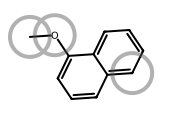

# Path-search performance (archive BFS / DFS vs live `find_path`)

What changed leaving classic metabolite enumeration for plan-guided `find_path`:
multi-edit targets that **CAP** under a shared archive yield limit often still
resolve quickly as long plans.

| Side | Package | Ruleset | Search |
| --- | --- | --- | --- |
| archive BFS | `xenosite._archive_forest` | PhaseOneQF | classic `bfs` metabolite enum |
| archive DFS | same | PhaseOneQF | classic `dfs` metabolite enum |
| live `find_path` | `xenosite.forest` | PhaseOne | plan-guided `find_path` |

**Caps:** archive `MAX_MOLS=200` (harness yield stop; depth=4); live
`max_nodes=800`. Tree: `feature/rule-refactor` @ `ba57d7e` (2026-09-20).
Raw: `artifacts/bench_find_path_h2h_3way.out`. Images:
[`performance_assets/`](performance_assets/) — xenopict `mark_atoms` circles on
**sites of metabolism only** (no atom-index labels); products MCS-aligned with
`align_to`.

```bash
uv run python tests/forest/bench_find_path_h2h.py
uv run python docs/forest/performance_assets/_render.py  # xenopict circles + MCS align
```

Why BFS/DFS fail the cap: they expand **ordered** walks; *k* commuting edits
≈ *k!* linearizations plus site fan-out. Live searches **plans** (`&` / Deps),
so long routes need not enumerate every ordering.

---

## Summary

| Case | HA | BFS | DFS | live `find_path` |
| --- | ---: | --- | --- | --- |
| [eugenol→allyl-Q](#1-eugenol--allyl-quinone) | 12 | CAP 0.516s · 200/200 | CAP 0.496s · 200/200 | **ok** 0.062s · 4 steps · 5/800 · bill=48 |
| [dimethoxy-PEA→catechol](#2-dimethoxy-pea--catechol) | 13 | CAP 0.484s · 200/200 | CAP 0.511s · 200/200 | **ok** 0.015s · 2 steps · 3/800 · bill=10 |
| [MeOPhOH→hydroxyQ](#3-4-methoxyphenol--hydroxyquinone) | 9 | CAP 0.536s · 200/200 | CAP 0.535s · 200/200 | **ok** 0.947s · 4 steps · 65/800 · bill=785 |
| [TBA→aldehyde](#4-tba--enyne-aldehyde) | 22 | CAP 1.276s · 200/200 | CAP 0.992s · 200/200 | **ok** 0.017s · 1 step · 2/800 · bill=5 |
| [2-MeO→1,2-NQ](#5a-reachable-2-meo--12-nq) | 12 | **ok** 0.057s · 8/200 · 1 hop | CAP 0.752s · 200/200 | **ok** 0.075s · 3 steps · 3/800 · bill=43 |
| [2-MeO→1,4-NQ](#5b-no-phaseone-path-2-meo--14-nq) | 12 | CAP (enum) | CAP (enum) | **no path** · queue empty nd=95 ≪ 800 · bill=1601 |

Hits: BFS **1/5** bench rows · DFS **0/5** · live **5/5** reachable rows.
Totals wall (5 bench cases): BFS 2.869s · DFS 3.287s · live 1.117s.

Column meanings: archive **mols/cap**; live **nodes/budget** and **bill**
(`mol_edits+nodes`). **CAP** = hit `MAX_MOLS` without target. **no path** =
frontier emptied (chemistry), not budget EXH.

---

## 1. Eugenol → allyl-quinone

| Reactant | Product |
| --- | --- |
| <br>`COc1ccc(CC=C)cc1O` | <br>`O=C1C=CC(=O)C(CC=C)=C1` |

| Method | Result | Wall | Work | Path length |
| --- | --- | ---: | --- | ---: |
| archive BFS | CAP | 0.516s | 200/200 mols | — |
| archive DFS | CAP | 0.496s | 200/200 mols | — |
| live `find_path` | **ok** | **0.062s** | 5/800 nodes · bill=48 | **4 steps** |

Multi-edit (dealkylation, hydroxylation, DH, dehydration). Ordering blow-up
fills the mol cap; live returns a 4-step plan.

```text
[Dealkylation; Hydroxylation; Dehydrogenation[…]; Dehydration | Hydroxylation ≺ Dehydrogenation]
```

---

## 2. Dimethoxy-PEA → catechol

| Reactant | Product |
| --- | --- |
| <br>`COc1ccc(CCN)cc1OC` | <br>`NCCc1ccc(O)c(O)c1` |

| Method | Result | Wall | Work | Path length |
| --- | --- | ---: | --- | ---: |
| archive BFS | CAP | 0.484s | 200/200 mols | — |
| archive DFS | CAP | 0.511s | 200/200 mols | — |
| live `find_path` | **ok** | **0.015s** | 3/800 nodes · bill=10 | **2 steps** |

Two commuting O-dealkylations → one unordered plan.

```text
(Dealkylation & Dealkylation)
```

---

## 3. 4-Methoxyphenol → hydroxyquinone

| Reactant | Product |
| --- | --- |
| <br>`COc1ccc(O)cc1` | <br>`O=C1C=C(O)C(=O)C(O)=C1` |

| Method | Result | Wall | Work | Path length |
| --- | --- | ---: | --- | ---: |
| archive BFS | CAP | 0.536s | 200/200 mols | — |
| archive DFS | CAP | 0.535s | 200/200 mols | — |
| live `find_path` | **ok** | **0.947s** | 65/800 nodes · bill=785 | **4 steps** |

Four concurrent edits; still a live win vs double CAP, but heavier work.

```text
(Dealkylation & Dehydrogenation & Hydroxylation & Hydroxylation)
```

---

## 4. TBA → enyne aldehyde

| Reactant | Product |
| --- | --- |
| <br>`CN(C/C=C/C#CC(C)(C)C)Cc1cccc2ccccc12` | <br>`CC(C)(C)C#CC=CC=O` |

| Method | Result | Wall | Work | Path length |
| --- | --- | ---: | --- | ---: |
| archive BFS | CAP | 1.276s | 200/200 mols | — |
| archive DFS | CAP | 0.992s | 200/200 mols | — |
| live `find_path` | **ok** | **0.017s** | 2/800 nodes · bill=5 | **1 step** |

22 heavy atoms: frontier size alone burns the mol cap; live is one N-dealkylation.

```text
Dealkylation
```

---

## 5a. Reachable: 2-MeO → 1,2-NQ

| Reactant | Product |
| --- | --- |
| <br>`COc1ccc2ccccc2c1` | <br>`O=C1C(=O)c2ccccc2C=C1` |

| Method | Result | Wall | Work | Path length |
| --- | --- | ---: | --- | ---: |
| archive BFS | **ok** | 0.057s | 8/200 mols | 1 hop |
| archive DFS | CAP | 0.752s | 200/200 mols | — |
| live `find_path` | **ok** | **0.075s** | 3/800 nodes · bill=43 | **3 steps** |

BFS can hit early here; DFS still CAPs. Live plan is three steps.

```text
[Dealkylation; Hydroxylation; Dehydrogenation[…] | Hydroxylation ≺ Dehydrogenation]
```

---

## 5b. No PhaseOne path: 2-MeO → 1,4-NQ

Same scannable layout — this is **chemistry reachability**, not a timed search fail.

| Reactant | Product |
| --- | --- |
| <br>`COc1ccc2ccccc2c1` | <br>`O=C1C=CC(=O)c2ccccc12` |

| Method | Result | Wall | Work | Path length |
| --- | --- | ---: | --- | ---: |
| archive BFS | CAP | ~0.97s | 200/200 mols | — |
| archive DFS | CAP | ~0.80s | 200/200 mols | — |
| live `find_path` | **no path** | ~3.1s | queue empty **95/800** nodes · bill=1601 | — |

Demethylation → 2-naphthol; PhaseOne cannot strip that C2 aryl oxygen to make
1,4-NQ. Not budget EXH (`nd ≪ max_nodes`). Circles mark demethylation SOM
(`[0, 1]`) only.

**Contrast — reachable isomer:** 1-MeO → 1,4-NQ (~0.07s, 3 steps):

| Reactant | Product |
| --- | --- |
| <br>`COc1cccc2ccccc12` | <br>`O=C1C=CC(=O)c2ccccc12` |

---

## Metric definitions

| Token | Meaning |
| --- | --- |
| CAP | archive yielded `MAX_MOLS` without the target |
| no path | live frontier emptied with `nodes < max_nodes` (unreachable under PhaseOne) |
| EXH | live `nodes` reached `max_nodes` without a hit |
| hops / steps | archive `len(sites)` · live `len(plan.steps)` |
| bill | live `mol_edits + nodes` |

Conjugation is not in PhaseOneQF / PhaseOne. Archive mols and live nodes are
different units — compare wall + hit/miss first.
