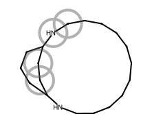

# Path-search performance (archive BFS / DFS vs live `find_path`)

What changed leaving classic metabolite enumeration for plan-guided `find_path`:
multi-edit targets that **CAP** under a shared archive yield limit often still
resolve quickly as long plans.

| Side | Package | Ruleset | Search |
| --- | --- | --- | --- |
| archive BFS | `xenosite._archive_forest` | PhaseOneQF | classic `bfs` metabolite enum |
| archive DFS | same | PhaseOneQF | classic `dfs` metabolite enum |
| live `find_path` | `xenosite.forest` | PhaseOne | plan-guided `find_path` |

**Caps:** archive `MAX_MOLS=200` (harness yield stop; depth=4); live
`max_nodes=800`. Tree: `feature/rule-refactor` @ `fec1594` + dirty working
tree (2026-09-20). Raw:
`artifacts/bench_find_path_h2h_3way_post_filter.{out,live.log,tee.log}`
(also default `bench_find_path_h2h_3way.out`). Images:
[`performance_assets/`](performance_assets/) — xenopict `mark_atoms` circles on
**sites of metabolism only** (no atom-index labels); products MCS-aligned with
`align_to`.

```bash
uv run python tests/forest/bench_find_path_h2h.py
uv run python tests/forest/bench_find_path_h2h.py --larger  # HA≈17–26; see Larger mols
uv run python tools/som_depict.py --preset performance --out-dir docs/forest/performance_assets
uv run python tools/som_depict.py --preset larger --out-dir docs/forest/performance_assets
```

Why BFS/DFS fail the cap: they expand **ordered** walks; *k* commuting edits
≈ *k!* linearizations plus site fan-out. Live searches **plans** (`&` / Deps),
so long routes need not enumerate every ordering.

---

## Summary

| Case | HA | BFS | DFS | live `find_path` |
| --- | ---: | --- | --- | --- |
| [eugenol→allyl-Q](#1-eugenol--allyl-quinone) | 12 | CAP 0.520s · 200/200 | CAP 0.511s · 200/200 | **ok** 0.025s · 4 steps · 5/800 · bill=19 |
| [dimethoxy-PEA→catechol](#2-dimethoxy-pea--catechol) | 13 | CAP 0.496s · 200/200 | CAP 0.564s · 200/200 | **ok** 0.008s · 2 steps · 3/800 · bill=10 |
| [MeOPhOH→hydroxyQ](#3-4-methoxyphenol--hydroxyquinone) | 9 | CAP 0.474s · 200/200 | CAP 0.470s · 200/200 | **ok** 0.206s · 4 steps · 28/800 · bill=180 |
| [TBA→aldehyde](#4-tba--enyne-aldehyde) | 22 | CAP 1.255s · 200/200 | CAP 0.977s · 200/200 | **ok** 0.016s · 1 step · 2/800 · bill=5 |
| [2-MeO→1,2-NQ](#5a-reachable-2-meo--12-nq) | 12 | **ok** 0.057s · 8/200 · 1 hop | CAP 0.757s · 200/200 | **ok** 0.008s · 3 steps · 3/800 · bill=7 |
| [2-MeO→1,4-NQ](#5b-no-phaseone-path-2-meo--14-nq) | 12 | CAP (enum) | CAP (enum) | **no path** · queue empty nd=95 ≪ 800 · bill=1601 |

Hits: BFS **1/5** bench rows · DFS **0/5** · live **5/5** reachable rows.
Totals wall (5 bench cases): BFS 2.802s · DFS 3.278s · live **0.264s**.

Column meanings: archive **mols/cap**; live **nodes/budget** and **bill**
(`mol_edits+nodes`). **CAP** = hit `MAX_MOLS` without target. **no path** =
frontier emptied (chemistry), not budget EXH.

---

## Larger mols

Mid-size live wall is still led by MeOPhOH→HQ (**0.206s** / bill **180**), but
no longer swamps the aggregate. Larger substrates (HA 17–26; path-outcome /
`substrate_library` cases) spread **archive vs live wall** more clearly: CAP
cost rises with frontier size while live stays plan-cheap. Live **bills stay
small** (short plans) — bill spread is still a MeOPhOH story, not a size
story.

Command: `uv run python tests/forest/bench_find_path_h2h.py --larger`.
Raw: `artifacts/bench_find_path_h2h_larger_post_filter.{out,live.log,tee.log}`
(@ `fec1594` + dirty).

| Case | HA | BFS | DFS | live `find_path` |
| --- | ---: | --- | --- | --- |
| tBu-bis-ND→dialdehyde | 24 | CAP 1.122s · 200/200 | CAP 1.107s · 200/200 | **ok** 0.070s · 2 steps · 6/800 · bill=36 |
| macrocycle-ND→aminoK | 20 | CAP 0.714s · 200/200 | CAP 0.786s · 200/200 | **ok** 0.137s · 2 steps · 3/800 · bill=26 |
| tribenzyl→PhCHO | 22 | **ok** 0.575s · 24/200 · 1 hop | CAP 1.297s · 200/200 | **ok** 0.005s · 1 step · 2/800 · bill=4 |
| triPh-butyl→OH | 26 | **ok** 0.600s · 32/200 · 1 hop | CAP 1.261s · 200/200 | **ok** 0.020s · 1 step · 2/800 · bill=5 |
| MeO-diphenyl→catechol | 17 | CAP 1.111s · 200/200 | CAP 0.700s · 200/200 | **ok** 0.036s · 2 steps · 3/800 · bill=7 |

Hits: BFS **2/5** · DFS **0/5** · live **5/5**.
Totals wall: BFS **4.123s** · DFS **5.151s** · live **0.269s** (~15× / ~19×).
Live wall range **0.005–0.137s** (≈30×); BFS CAP floors ≈0.58–1.12s.

Depict: `uv run python tools/som_depict.py --preset larger --out-dir docs/forest/performance_assets`
(SoM via `find_path`; products MCS-aligned).

### tBu-bis-ND → dialdehyde

| Reactant | Product |
| --- | --- |
| <br>`CN(C)Cc1ccc(CN(C)Cc2ccc(C(C)(C)C)cc2)cc1` | <br>`O=Cc1ccc(C=O)cc1` |

### macrocycle-ND → aminoK

| Reactant | Product |
| --- | --- |
| <br>`C1CCCCCCNC2CCCC(CC2)NCCCC1` | <br>`NC1CCCC(=O)CC1` |

### tribenzyl → PhCHO

| Reactant | Product |
| --- | --- |
| <br>`N(Cc1ccccc1)(Cc1ccccc1)Cc1ccccc1` | <br>`O=Cc1ccccc1` |

### triPh-butyl → OH

| Reactant | Product |
| --- | --- |
| <br>`c1ccccc1CCCCc2ccccc2CCCCc3ccccc3` | <br>`Oc1ccccc1CCCCc2ccccc2CCCCc3ccccc3` |

### MeO-diphenyl → catechol

| Reactant | Product |
| --- | --- |
| <br>`COc1ccc(Cc2ccc(OC)cc2)cc1` | <br>`Oc1ccc(Cc2ccc(O)cc2)cc1` |

---

## 1. Eugenol → allyl-quinone

| Reactant | Product |
| --- | --- |
| <br>`COc1ccc(CC=C)cc1O` | <br>`O=C1C=CC(=O)C(CC=C)=C1` |

| Method | Result | Wall | Work | Path length |
| --- | --- | ---: | --- | ---: |
| archive BFS | CAP | 0.520s | 200/200 mols | — |
| archive DFS | CAP | 0.511s | 200/200 mols | — |
| live `find_path` | **ok** | **0.025s** | 5/800 nodes · bill=19 | **4 steps** |

Multi-edit (dealkylation, hydroxylation, DH, dehydration). Ordering blow-up
fills the mol cap; live returns a 4-step plan.

```text
[Dealkylation; Hydroxylation; Dehydrogenation[…]; Dehydration | Hydroxylation ≺ Dehydrogenation]
```

---

## 2. Dimethoxy-PEA → catechol

| Reactant | Product |
| --- | --- |
| <br>`COc1ccc(CCN)cc1OC` | <br>`NCCc1ccc(O)c(O)c1` |

| Method | Result | Wall | Work | Path length |
| --- | --- | ---: | --- | ---: |
| archive BFS | CAP | 0.496s | 200/200 mols | — |
| archive DFS | CAP | 0.564s | 200/200 mols | — |
| live `find_path` | **ok** | **0.008s** | 3/800 nodes · bill=10 | **2 steps** |

Two commuting O-dealkylations → one unordered plan.

```text
(Dealkylation & Dealkylation)
```

---

## 3. 4-Methoxyphenol → hydroxyquinone

| Reactant | Product |
| --- | --- |
| <br>`COc1ccc(O)cc1` | <br>`O=C1C=C(O)C(=O)C(O)=C1` |

| Method | Result | Wall | Work | Path length |
| --- | --- | ---: | --- | ---: |
| archive BFS | CAP | 0.474s | 200/200 mols | — |
| archive DFS | CAP | 0.470s | 200/200 mols | — |
| live `find_path` | **ok** | **0.206s** | 28/800 nodes · bill=180 | **4 steps** |

Four concurrent edits; live win vs double CAP. Highest mid-size bill in this
panel (residual Epoxidation + seen-after-edit retracing — `seen` keys child
CSMI at enqueue, so parents still pay `mol_edits` before the seen check).

```text
(Dealkylation & Dehydrogenation & Hydroxylation & Hydroxylation)
```

Dehydrogenation **removes H** (oxidative); do not confuse with Hydrogenation
(**adds H**). Closers refuse reductive adds-H toward oxidative quinone
targets (see HEURISTICS).

---

## 4. TBA → enyne aldehyde

| Reactant | Product |
| --- | --- |
| <br>`CN(C/C=C/C#CC(C)(C)C)Cc1cccc2ccccc12` | <br>`CC(C)(C)C#CC=CC=O` |

| Method | Result | Wall | Work | Path length |
| --- | --- | ---: | --- | ---: |
| archive BFS | CAP | 1.255s | 200/200 mols | — |
| archive DFS | CAP | 0.977s | 200/200 mols | — |
| live `find_path` | **ok** | **0.016s** | 2/800 nodes · bill=5 | **1 step** |

22 heavy atoms: frontier size alone burns the mol cap; live is one N-dealkylation.

```text
Dealkylation
```

---

## 5a. Reachable: 2-MeO → 1,2-NQ

| Reactant | Product |
| --- | --- |
| <br>`COc1ccc2ccccc2c1` | <br>`O=C1C(=O)c2ccccc2C=C1` |

| Method | Result | Wall | Work | Path length |
| --- | --- | ---: | --- | ---: |
| archive BFS | **ok** | 0.057s | 8/200 mols | 1 hop |
| archive DFS | CAP | 0.757s | 200/200 mols | — |
| live `find_path` | **ok** | **0.008s** | 3/800 nodes · bill=7 | **3 steps** |

BFS can hit early here; DFS still CAPs. Live plan is three steps.

```text
[Dealkylation; Hydroxylation; Dehydrogenation[…] | Hydroxylation ≺ Dehydrogenation]
```

---

## 5b. No PhaseOne path: 2-MeO → 1,4-NQ

Same scannable layout — this is **chemistry reachability**, not a timed search fail.

| Reactant | Product |
| --- | --- |
| <br>`COc1ccc2ccccc2c1` | <br>`O=C1C=CC(=O)c2ccccc12` |

| Method | Result | Wall | Work | Path length |
| --- | --- | ---: | --- | ---: |
| archive BFS | CAP | ~0.97s | 200/200 mols | — |
| archive DFS | CAP | ~0.80s | 200/200 mols | — |
| live `find_path` | **no path** | ~3.1s | queue empty **95/800** nodes · bill=1601 | — |

Demethylation → 2-naphthol; PhaseOne cannot strip that C2 aryl oxygen to make
1,4-NQ. Not budget EXH (`nd ≪ max_nodes`). Circles mark demethylation SOM
(`[0, 1]`) only.

**Contrast — reachable isomer:** 1-MeO → 1,4-NQ (~0.07s, 3 steps):

| Reactant | Product |
| --- | --- |
| <br>`COc1cccc2ccccc12` | <br>`O=C1C=CC(=O)c2ccccc12` |

---

## Metric definitions

| Token | Meaning |
| --- | --- |
| CAP | archive yielded `MAX_MOLS` without the target |
| no path | live frontier emptied with `nodes < max_nodes` (unreachable under PhaseOne) |
| EXH | live `nodes` reached `max_nodes` without a hit |
| hops / steps | archive `len(sites)` · live `len(plan.steps)` |
| bill | live `mol_edits + nodes` (see below) |

### What `bill` counts

`PathCounters.billed` = **`mol_edits + nodes`** (`src/xenosite/forest/find_path.py`).

| Counter | Increments when |
| --- | --- |
| `nodes` | a frontier walk is popped and expanded (or accepted as a target hit) |
| `mol_edits` | one `react_at` / RunReactants call, or one ResonancePair unique-edit combo (kekulé/path fan-out inside that combo is not a second bill) |

**Not** in `bill`: `rule_expansions`, `sites_considered`, `sites_skipped`, `sanitize_dropped`, wall time. Measurement only — not a second search mode. Archive mols and live nodes are different units.

Conjugation is not in PhaseOneQF / PhaseOne. Compare wall + hit/miss first.
