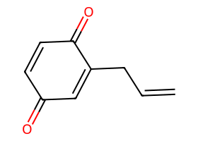
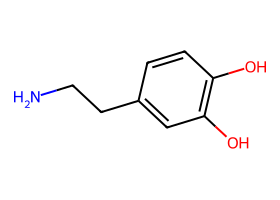
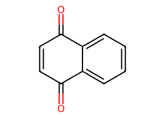
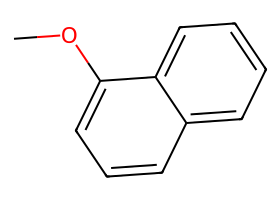

# Path-search performance (archive BFS / DFS vs live `find_path`)

Head-to-head after the POC → `xenosite.forest` swap. The point of this page is
not a single aggregate speedup — it is what changes when you leave classic
metabolite enumeration (archive BFS/DFS) for the new plan-guided `find_path`.

| Side | Package | Ruleset | What it does |
| --- | --- | --- | --- |
| **archive BFS** | `xenosite._archive_forest` | PhaseOneQF | Classic breadth-first metabolite enumeration (`bfs`) |
| **archive DFS** | same | PhaseOneQF | Classic depth-first metabolite enumeration (`dfs`) |
| **live `find_path`** | `xenosite.forest` | PhaseOne | Plan-guided search (`find_path.find_path`) |

Tree: `feature/rule-refactor` @  (2026-09-20). Raw log:
`artifacts/bench_find_path_h2h_3way.out`.

Molecule depictions live in [`performance_assets/`](performance_assets/) (RDKit SVG).

## Why BFS/DFS blow up on multi-edit targets

Classic search expands **ordered reaction sequences**. A target that needs *k*
edits, several of which commute, has on the order of *k!* linearizations, and
each hop fans out into many other sites. Under a fixed metabolite yield cap the
frontier fills with near-misses long before the target appears.

Live `find_path` searches **plans** (Deps / unordered `&` where chemistry
allows). It does not have to materialize every ordering as a separate walk, so
long multi-edit routes often appear in tens of milliseconds to about a second.

## Caps (shared story, different units)

| Knob | Value | Role |
| --- | ---: | --- |
| `MAX_MOLS` | **200** | Archive only — harness stops after this many yielded metabolites (`max_paths` + consumer break). No archive source edits. |
| `ARCHIVE_DEPTH` | **4** | Classic hop ceiling. |
| `LIVE_MAX_NODES` | **800** | Live `find_path` node budget (native unit). |

Archive DFS passes `all_paths=True` at the call site so an empty endpoint set
does not trip an archive early-return quirk during enumeration. Re-run:

```bash
uv run python tests/forest/bench_find_path_h2h.py
```

## Summary table

| Case | HA | archive BFS | archive DFS | live `find_path` |
| --- | ---: | --- | --- | --- |
| eugenol→allyl-quinone | 12 | CAP 0.516s (200/200) | CAP 0.496s | **ok** 0.062s · **4 steps** · 5/800 nodes |
| dimethoxy-PEA→catechol | 13 | CAP 0.484s | CAP 0.511s | **ok** 0.015s · **2 steps** · 3/800 nodes |
| MeOPhOH→hydroxyquinone | 9 | CAP 0.536s | CAP 0.535s | **ok** 0.947s · **4 steps** · 65/800 nodes |
| TBA→enyne aldehyde | 22 | CAP 1.276s | CAP 0.992s | **ok** 0.017s · **1 step** · 2/800 nodes |
| 2-MeO-naph→1,2-NQ | 12 | ok 0.057s (8 mols, 1 hop) | CAP 0.752s | **ok** 0.075s · **3 steps** · 3/800 nodes |

Valid hits this run: archive BFS **1/5**, archive DFS **0/5**, live **5/5**.
The first four are the main story (both archive modes CAP). Naphthalene is a
reachable multi-edit retune — BFS can hit early; DFS still caps.

---

## Example 1 — Eugenol → allyl-quinone (long plan, fast)

| Reactant | Product |
| --- | --- |
| <br>`COc1ccc(CC=C)cc1O` | <br>`O=C1C=CC(=O)C(CC=C)=C1` |

12 heavy atoms. Needs several Phase-I edits (O-dealkylation, ring hydroxylation,
dehydrogenation, dehydration) with precedence among some steps. Archive BFS/DFS
each burn the full **200** metabolite yields in ~0.5s without seeing the quinone
— the ordering × site fan-out fills the cap.

Live returns a **4-step** plan in **0.062s** (5 nodes / 800):

```text
[Dealkylation; Hydroxylation; Dehydrogenation[…]; Dehydration | Hydroxylation ≺ Dehydrogenation]
```

This is the headline “long path, short wall” win.

## Example 2 — Dimethoxy-PEA → catechol (unordered pair)

| Reactant | Product |
| --- | --- |
| <br>`COc1ccc(CCN)cc1OC` | <br>`NCCc1ccc(O)c(O)c1` |

13 heavy atoms. Two O-dealkylations that commute. Classic enumeration must try
both orders among a large ether/alkyl frontier; under `MAX_MOLS=200` both BFS
and DFS **CAP** (~0.5s).

Live treats them as a single unordered plan and finishes in **0.015s**
(**2 steps**, 3 nodes):

```text
(Dealkylation & Dealkylation)
```

Moving off ordered metabolite search is exactly what makes this cheap.

## Example 3 — 4-Methoxyphenol → hydroxyquinone (four concurrent edits)

| Reactant | Product |
| --- | --- |
| <br>`COc1ccc(O)cc1` | <br>`O=C1C=C(O)C(=O)C(O)=C1` |

Four edits that the live planner can hold together (`&`). Archive BFS/DFS again
hit **CAP** at 200 mols. Live still finds it — **4 steps in 0.947s** (65 nodes,
bill=785). Slower than eugenol, but still a clear win versus a capped miss, and
a reminder that hard quinone targets remain work-heavy even with plans.

```text
(Dealkylation & Dehydrogenation & Hydroxylation & Hydroxylation)
```

## Example 4 — TBA → enyne aldehyde (mid-size frontier)

| Reactant | Product |
| --- | --- |
| <br>`CN(C/C=C/C#CC(C)(C)C)Cc1cccc2ccccc12` | <br>`CC(C)(C)C#CC=CC=O` |

22 heavy atoms. Chemically a single N-dealkylation/cleavage, but the mid-size
reactant sprouts a huge metabolite frontier. Archive BFS/DFS exhaust **200**
yields (~1–1.3s) without emitting the aldehyde. Live finds the **1-step** plan
in **0.017s** (2 nodes). Size alone, not only multi-edit factorial, is enough
for classic enumeration to fail the cap.

## Example 5 — Methoxynaphthalene quinones (reachable vs no path)

### Reachable: 2-MeO-naphthalene → 1,2-NQ

| Reactant | Product |
| --- | --- |
| <br>`COc1ccc2ccccc2c1` | <br>`O=C1C(=O)c2ccccc2C=C1` |

Live finds a **3-step** plan in **0.075s** (3 nodes):

```text
[Dealkylation; Hydroxylation; Dehydrogenation[…] | Hydroxylation ≺ Dehydrogenation]
```

Archive DFS still **CAP**s at 200 mols; archive BFS can hit early (~8 yields)
on this particular pair — reported honestly, not as a universal BFS miss.

### No PhaseOne path (not a search bug): 2-MeO → 1,4-NQ

| Reactant | Product |
| --- | --- |
| <br>`COc1ccc2ccccc2c1` | <br>`O=C1C=CC(=O)c2ccccc12` |

Demethylation yields 2-naphthol. PhaseOne cannot remove that C2 aryl oxygen to
reach 1,4-NQ (frontier empties at ~95 nodes ≪ `max_nodes`; not budget EXH).

The isomer pair **1-MeO → 1,4-NQ** *is* reachable (~0.07s, 3 steps):

| Reactant | Product |
| --- | --- |
| <br>`COc1cccc2ccccc12` | <br>`O=C1C=CC(=O)c2ccccc12` |

Kept as a chemistry note so an unreachable 2-MeO→1,4 target is not mistaken for
a `find_path` failure.

---

## What changed vs rule-attached / classic search

- **Archive BFS/DFS** (old `RuleSet.find_path` / CLI enumeration): expand
  metabolites hop-by-hop. Bound cost in this bench with a harness **yield cap**
  (`MAX_MOLS`), not invasive archive budget wiring.
- **Live `find_path`**: expand plans toward the target formula/structure, with a
  native **node** budget. Multi-edit and unordered steps are data on the plan,
  so long routes do not require exploring every linearization.

Compare wall clock and hit/miss first. Archive “mols yielded” and live “nodes /
billed” are different units — do not equate them.

## Metric definitions

- **CAP** — archive yielded `MAX_MOLS` metabolites without the target.
- **miss (live)** — no valid path; if `nodes < max_nodes`, the frontier emptied
  (reachability / chemistry), not budget exhaustion.
- **EXH** — live `nodes` reached `max_nodes` without a valid hit.
- **hops / steps** — archive: `len(sites)` on the metabolite walk; live:
  `len(plan.steps)`.
- Conjugation is not in PhaseOneQF / PhaseOne.

## Regenerating images

```bash
uv run python src/xenosite/forest/performance_assets/_render.py
```
